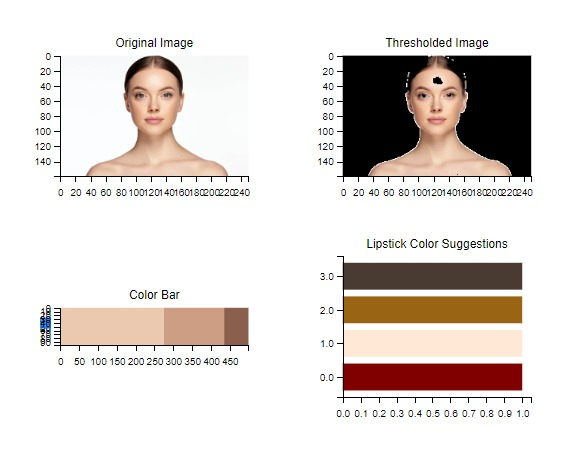
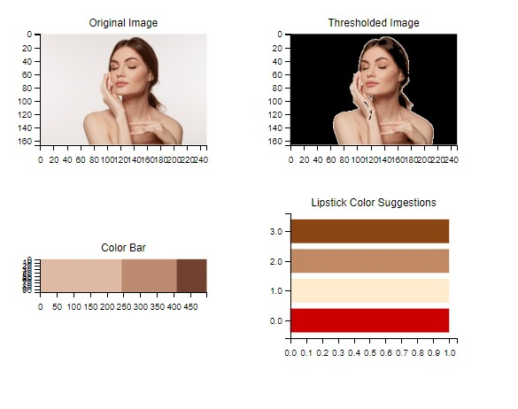
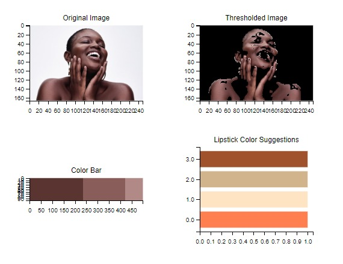

# Skin Color Analysis and Lipstick Suggestion

This Python script performs skin color analysis and suggests suitable lipstick colors based on the dominant skin tones extracted from an input image. It uses image processing techniques and K-means clustering to identify and analyze skin colors.

## Features

- **Skin Color Extraction:** Utilizes HSV color space to extract skin colors from the input image.
- **Dominant Color Extraction:** Applies K-means clustering to identify dominant colors in the extracted skin regions.
- **Black Color Removal:** Removes black color clusters to improve the accuracy of color analysis.
- **Lipstick Color Suggestion:** Suggests suitable lipstick colors based on the identified dominant skin tones.
- **Visualization:** Generates color bars and bar charts to visually represent dominant colors and lipstick suggestions.

## How to Use

1. **Clone the Repository**
2. **Install Dependencies**   
    Ensure you have the following dependencies installed:  
      - numpy  
      - opencv-python  
      - scikit-learn  
      - imutils  
      - matplotlib  
3. **Run the Script**
4. **View Results**  
     The script will display the original image, thresholded image, color information, color bars, and lipstick suggestions.

## Example

- Example for fair skin
    
 

- Example for medium skin
  
  

- Example for dark skin
    

## Feedback and Contributions

Your feedback is invaluable to me! If you have any suggestions, feature requests, or encounter any issues while using this code, please feel free to reach out to me.

## Contact Information

For more information or inquiries, please contact OUMAIMA MOUNIRI at mouniri.ouma@gmail.com

